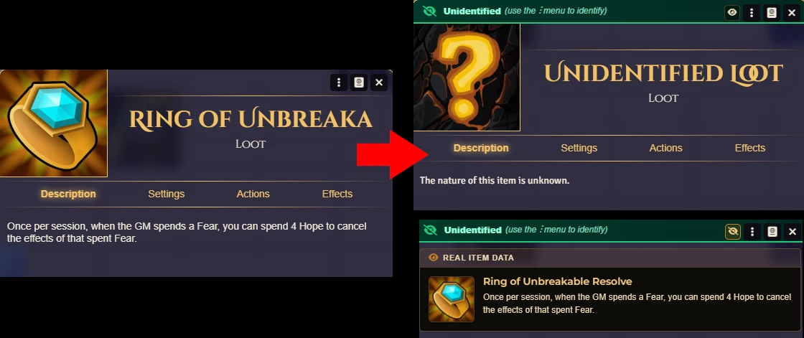
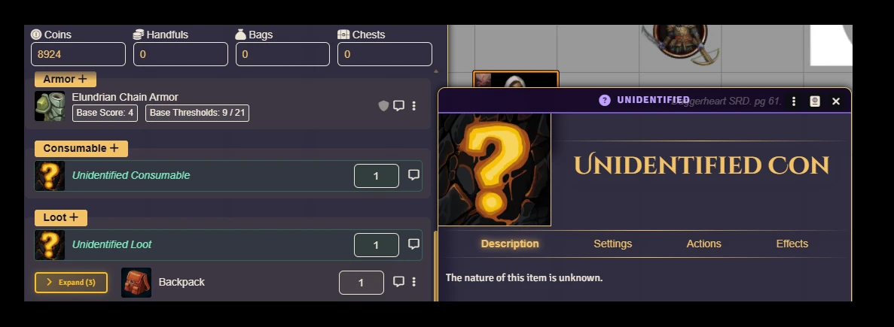
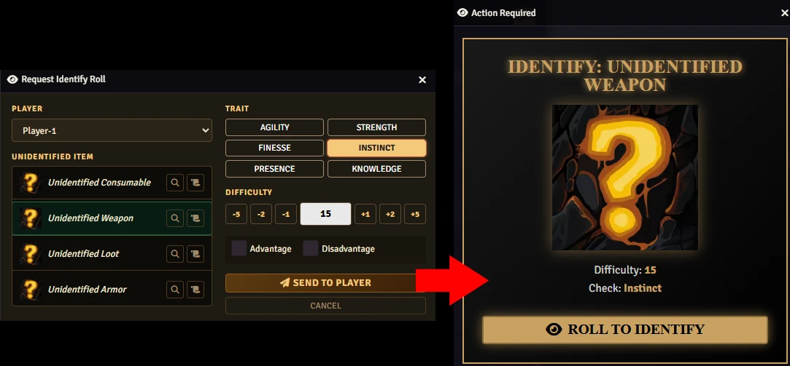

# 🔍 Unidentified Items

## for Daggerheart

**Hide items from your players. Reveal them when the moment is right.**

Running a mystery? Handing out cursed loot? Keeping players guessing about that strange artifact they just found? **Unidentified Items** is a Foundry VTT module for **Daggerheart** that lets you disguise any item — weapon, consumable, piece of loot — so players only see a masked name and icon until *you* decide to reveal the truth.

No more accidentally spoiling the twist. No more players metagaming because they recognized an item name in their inventory.

---

## What It Does

When you mark an item as unidentified, your players see a generic placeholder — something like *"Unidentified Weapon"* or *"Unidentified Consumable"* — instead of the real item. You control what gets revealed and when.

Here's the full loop:

- **Disguise any item** — give it a fake name, a fake image, or both
- **Request an Identify Roll** — send a roll request to a specific player, choosing the trait and difficulty yourself
- **Reveal on success** — the item shows its true identity the moment the roll lands
- **Keep secrets on failure** — the item stays masked, mystery intact

As the GM, you always see what things really are. Players only see the mask.

---

## How It Looks in Play

> *Your players enter a dungeon and find a glowing blade on the floor. In their inventory, it appears as "Unidentified Weapon" with a question mark icon. Later, when they try to figure out what it is, you open the Identify Request dialog — pick the player, pick the trait (maybe Knowledge? Instinct?), set a difficulty, and send it. The dice roll. On a success, the item reveals itself as "Sword of Eternal Light" complete with its full description. The table reacts.*

That's the experience this module creates.

### GM View

<p align="center">
  
</p>

### Player View

<p align="center">
  
</p>

### Identify

<p align="center">
  
</p>

---

## Features at a Glance

| Feature | Description |
|---|---|
| **Mark items as unidentified** | Works on weapons, consumables, and loot |
| **Custom mask** | Set a fake name and fake image per item |
| **Identify Roll request** | Send a roll to any player from a clean dialog |
| **Trait & difficulty control** | You pick the trait (Agility, Knowledge, etc.) and the DC |
| **Advantage / Disadvantage** | Supported in the roll request |
| **Auto-reveal on success** | Item updates automatically when the roll passes |
| **GM always sees real data** | Peek at the true item name and description at any time |

---

## How to Use

**Step 1 — Unidentify an item**

Right-click any item in an actor's inventory and look for the *"Mark as Unidentified"* option. You can optionally set a custom name and image to show the player.

**Step 2 — Request an Identify Roll**

When the player wants to examine the item, open the **Identify Request** dialog from the GM toolbar or run `Identify.Open();`. Choose the player, select which item they're examining, pick a trait and difficulty, then click **Send to Player**.

**Step 3 — Watch the roll**

The player rolls. If they succeed, the item reveals itself automatically. If they fail, it stays hidden — you can try again later, or just tell them what it is if the story calls for it.

**Step 4 — Manual reveal (optional)**

You can also reveal any item manually at any time, no roll needed. Just right-click and choose *"Reveal Item"*.

---

## Installation

Install via the Foundry VTT Module browser or use this manifest link:

```
https://raw.githubusercontent.com/brunocalado/dh-unidentified/main/module.json
```

## Credits & License

* **Code License:** GNU GPLv3.

* **banner.webp and thumbnail.webp:** [Question mark icons created by Freepik - Flaticon](https://www.flaticon.com/free-icons/question-mark).

* **failure.mp3, success.mp3:** [License](https://pixabay.com/service/license-summary/)

* **This is a fork from:** [Link](https://github.com/jacksands/dh-unidentified)

**Disclaimer:** This module is an independent creation and is not affiliated with Darrington Press.


# 🧰 My Daggerheart Modules

| Module | Description |
| :--- | :--- |
| 💀 [**Adversary Manager**](https://github.com/brunocalado/daggerheart-advmanager) | Scale adversaries instantly and build balanced encounters in Foundry VTT. |
| 🌟 [**Best Modules**](https://github.com/brunocalado/dh-best-modules) | A curated collection of essential modules to enhance the Daggerheart experience. |
| 💥 [**Critical**](https://github.com/brunocalado/daggerheart-critical) | Animated Critical. |
| 💠 [**Custom Stat Tracker**](https://github.com/brunocalado/dh-new-stat-tracker) | Add custom trackers to actors. |
| ☠️ [**Death Moves**](https://github.com/brunocalado/daggerheart-death-moves) | Enhances the Death Move moment with a dramatic interface and full automation. |
| 📏 [**Distances**](https://github.com/brunocalado/daggerheart-distances) | Visualizes combat ranges with customizable rings and hover calculations. |
| 📦 [**Extra Content**](https://github.com/brunocalado/daggerheart-extra-content) | Homebrew for Daggerheart. |
| 🤖 [**Fear Macros**](https://github.com/brunocalado/daggerheart-fear-macros) | Automatically executes macros when the Fear resource is changed. |
| 😱 [**Fear Tracker**](https://github.com/brunocalado/daggerheart-fear-tracker) | Adds an animated slider bar with configurable fear tokens to the UI. |
| 🎁 [**Mystery Box**](https://github.com/brunocalado/dh-mystery-box) | Introduces mystery box mechanics for random loot and surprises. |
| ⚡ [**Quick Actions**](https://github.com/brunocalado/daggerheart-quickactions) | Quick access to common mechanics like Falling Damage, Downtime, etc. |
| 📜 [**Quick Rules**](https://github.com/brunocalado/daggerheart-quickrules) | Fast and accessible reference guide for the core rules. |
| 🎲 [**Stats**](https://github.com/brunocalado/daggerheart-stats) | Tracks dice rolls from GM and Players. |
| 🧠 [**Stats Toolbox**](https://github.com/brunocalado/dh-statblock-importer) | Import using a statblock. |
| 🛒 [**Store**](https://github.com/brunocalado/daggerheart-store) | A dynamic, interactive, and fully configurable store for Foundry VTT. |
| 🔍 [**Unidentified**](https://github.com/brunocalado/dh-unidentified) | Obfuscates item names and descriptions until they are identified by the players. |

# 🗺️ Adventures

| Adventure | Description |
| :--- | :--- |
| ✨ [**I Wish**](https://github.com/brunocalado/i-wish-daggerheart-adventure) | A wealthy merchant is cursed; one final expedition may be the only hope. |
| 💣 [**Suicide Squad**](https://github.com/brunocalado/suicide-squad-daggerheart-adventure) | Criminals forced to serve a ruthless master in a land on the brink of war. |